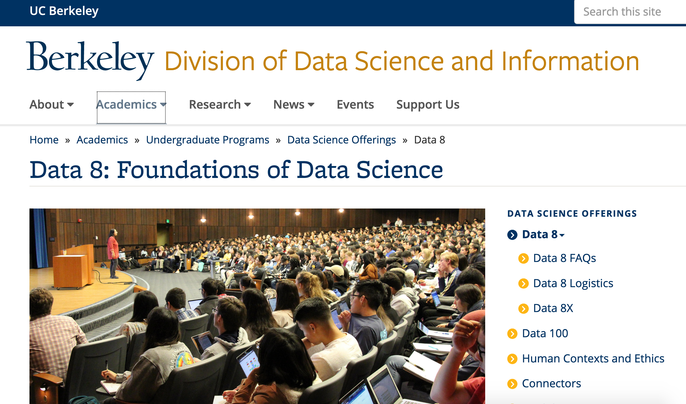

---
# YAML metadata
title: "Resampling as a cure for traditional statistics"
author: Matthew Brett
bibliography: ../data-science-bib/data_science.bib
<#ifndef HANDOUT>
suppress-bibliography: true
<#endif>
bibliography: data-science-bib/data_science.bib
---

# Traditional teaching doesn't work

> But we’ve been trying to [teach the fundamentals of statistical analysis]
> for decades and it just hasn’t worked. Instead we have run course after
> course that students hate. We’ve turned out generations of graduates who can
> remember sitting in labs pressing buttons in statistical software programmes
> like SPSS, but never really learned how to connect statistics to important
> issues in the real world.

[What do you get if you don't teach stats properly? Farage and
Trump](https://www.theguardian.com/education/2019/apr/03/what-do-you-get-if-you-dont-teach-stats-properly-farage-and-trump)
(Robert de Vries, Guardian, April 2019).

# Statistics teachers think we need to change track

George Cobb (2015): \"Mere renovation is too little too late: we need
to rethink our undergraduate curriculum from the ground up".

See article and discussion at  <https://nhorton.people.amherst.edu/mererenovation>.

# The traditional approach is fast approaching a dead end

[@cobb2007introductory]

# Data science!

# Why now?

* Improvements in languages
* Greater experience of coding in science
* Marriage of coding and data analysis
* Data science!

[What is data science?](https://matthew-brett.github.io/dsfe/chapters/01/what-is-data-science) (link)

# This session

* Introduction to R
* A mosquito problem

This is about 8 hours of teaching and practice

# A mosquito problem

With thanks to John Rauser: [Statistics Without the Agonizing Pain](https://www.youtube.com/watch?v=5Dnw46eC-0o)

# The data

# The t-test

# The permutation way

* Calculate difference in means
* Pool
* Repeat many times:
    * Shuffle
    * Split
    * Recalculate difference in means
    * Store

# On balls

# The difference in means

# The difference in means: 23.60 - 19.22 4.38

# Shuffle

# A difference if the null is true

# One difference on null: 22.84 - 20.28 = -1.26

# And again

# Another difference on null: 22.20 - 21.17 = 1.03

# And so on, 10000 times

# But how?

On to the notebook.
