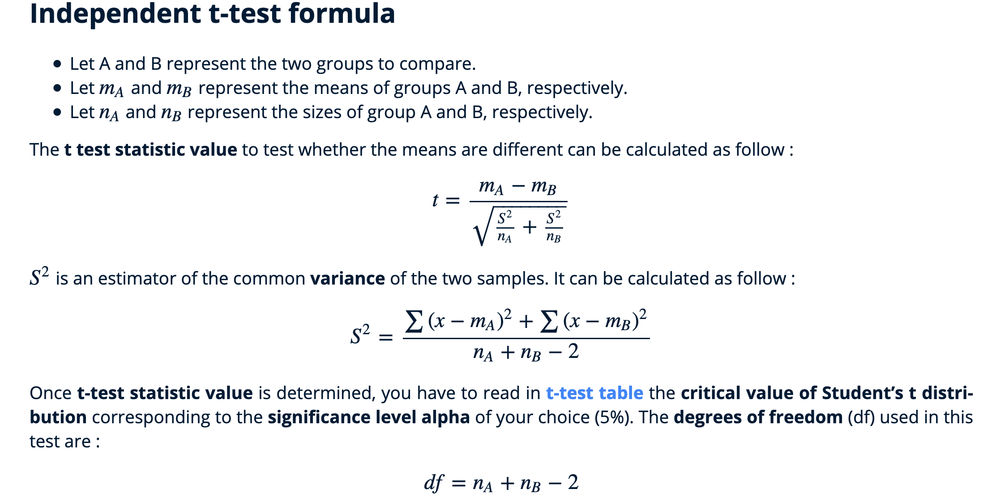
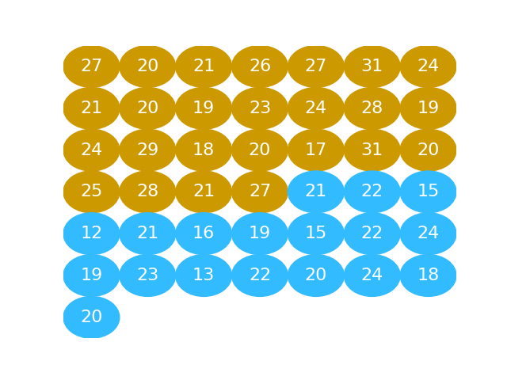
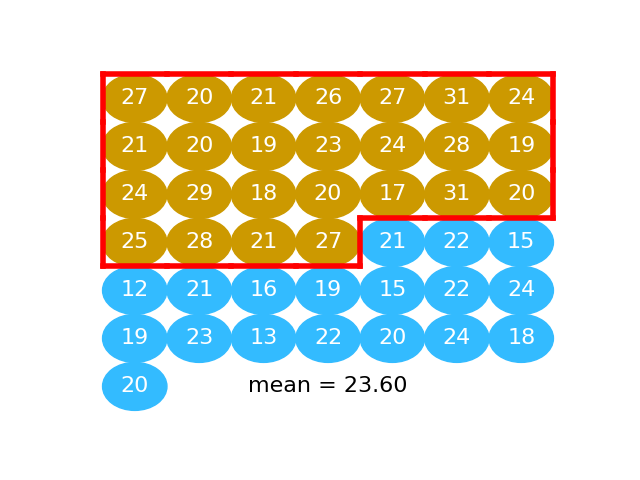
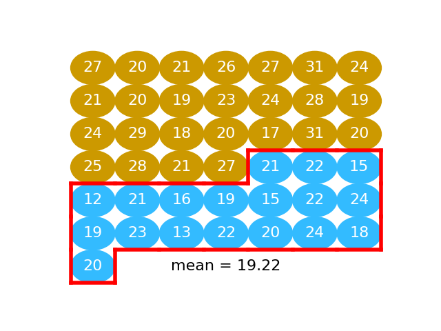
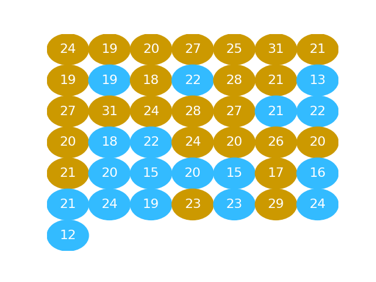
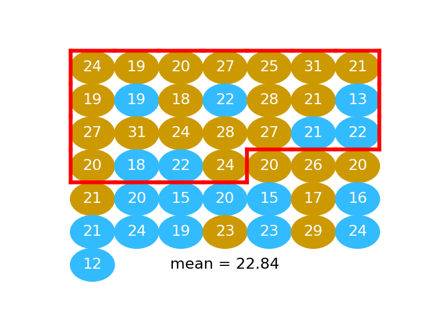
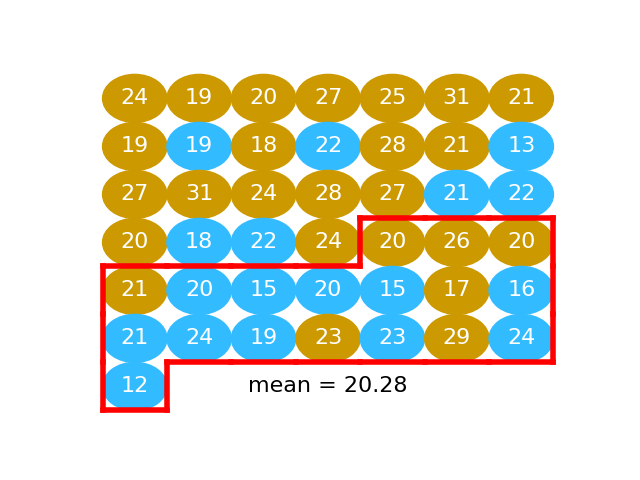
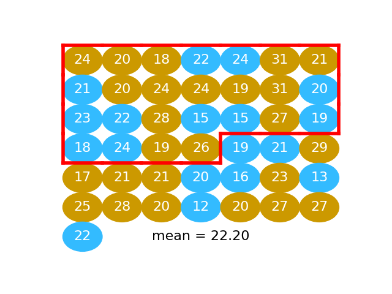
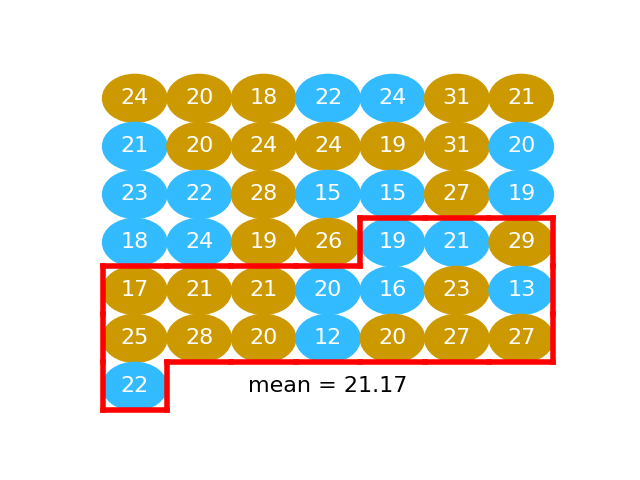
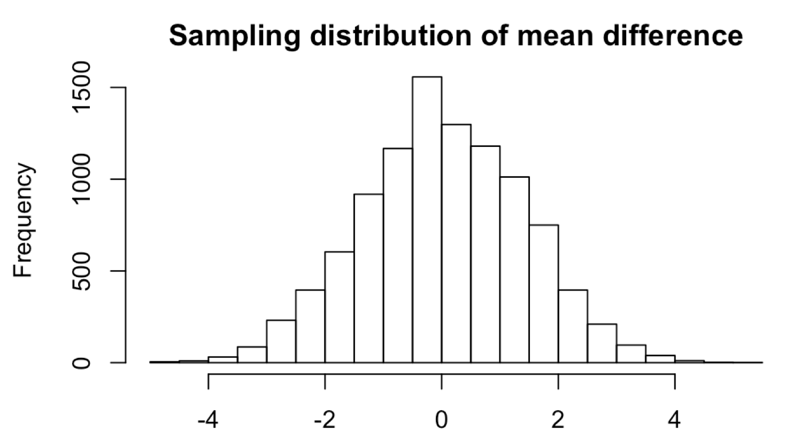

---
# YAML metadata
title: "Resampling as a cure for traditional statistics"
author: Matthew Brett
bibliography: ../data-science-bib/data_science.bib
<#ifndef HANDOUT>
suppress-bibliography: true
<#endif>
bibliography: data-science-bib/data_science.bib
---

# Traditional teaching doesn't work

> But we’ve been trying to [teach the fundamentals of statistical analysis]
> for decades and it just hasn’t worked. Instead we have run course after
> course that students hate. We’ve turned out generations of graduates who can
> remember sitting in labs pressing buttons in statistical software programmes
> like SPSS, but never really learned how to connect statistics to important
> issues in the real world.

[What do you get if you don't teach stats properly? Farage and
Trump](https://www.theguardian.com/education/2019/apr/03/what-do-you-get-if-you-dont-teach-stats-properly-farage-and-trump)
(Robert de Vries, Guardian, April 2019).

# Statistics teachers think we need to change track

George Cobb (2015): \"Mere renovation is too little too late: we need
to rethink our undergraduate curriculum from the ground up".

See article and discussion at  <https://nhorton.people.amherst.edu/mererenovation>.

# The traditional approach is fast approaching a dead end

[@cobb2007introductory]

# General agreement on computing instead of mathematics

> We begin our discussion by emphasizing the parts of Cobb's\
> article we can unequivocally stand behind: we also recommend\
> the substitution of computing in the place of mathematics, and\
> we are moving this way in our own teaching: not just having\
> students learn a statistics package, but having them do real (if\
> simple) programming to manipulate, graph, and analyze data,\
> and to simulate random processes.

Reply to "Mere Renovation" article by Andrew Gelman, Eric Loken:  <https://nhorton.people.amherst.edu/mererenovation>.

# Why now?

* Improvements in languages
* Greater experience of coding in science
* Marriage of coding and data analysis
* Data science!

<https://matthew-brett.github.io/dsfe/chapters/01/what-is-data-science>

# This session

* Introduction to R
* A mosquito problem

This is about 8 hours of teaching and practice

# A mosquito problem

With thanks to John Rauser: [Statistics Without the Agonizing Pain](https://www.youtube.com/watch?v=5Dnw46eC-0o)

# The t-test

# The permutation way

* Calculate difference in means
* Pool
* Repeat many times:
    * Shuffle
    * Split
    * Recalculate difference in means
    * Store

# On balls

# The difference in means

# The difference in means: 23.60 - 19.22 4.38

# Shuffle

# A difference if the null is true

# One difference on null: 22.84 - 20.28 = -1.26

# And again

# Another difference on null: 22.20 - 21.17 = 1.03

# And so on, 10000 times

# Extra slides

# The Ptolemaic curriculum

> What we teach is largely the technical machinery of numerical
> approximations based on the normal distribution and its many
> subsidiary cogs. This machinery was once necessary, because the
> conceptually simpler alternative based on permutations was
> computationally beyond our reach. Before computers statisticians had
> no choice. These days we have no excuse. Randomization-based
> inference makes a direct connection between data production and the
> logic of inference that deserves to be at the core of every
> introductory course. Technology allows us to do more with less: more
> ideas, less technique.

[@cobb2007introductory]

# Why Ptolemaic?

> Ptolemy’s cosmology was needlessly complicated, because he put the
> earth at the center of his system, instead of putting the sun at the
> center.  Our curriculum is needlessly complicated because we put the
> normal distribution, as an approximate sampling distribution for the
> mean, at the center of our curriculum, instead of putting the core
> logic of inference at the center.

[@cobb2007introductory]

# Fisher said so

> the statistician does not carry out this very simple and very
> tedious process, but his conclusions have no justification beyond
> the fact that they agree with those which could have been arrived at
> by this elementary method.”

Fisher, R.A. (1936), “The coefficient of racial likeness and the
future of craniometry” Journal of the Royal Anthropological Institute
of Great Britain and Ireland , vol.  66, pp.  57-63

# But what about t-tests?

> Question:  Why,  then,  is the t-test the centerpiece of the
> introductory statistics curriculum?  Answer:  The t-test is what
> scientists and social scientists use most often.

> Question: Why does everyone use the t-test?  Answer: Because it’s
> the centerpiece of the introductory statistics curriculum

