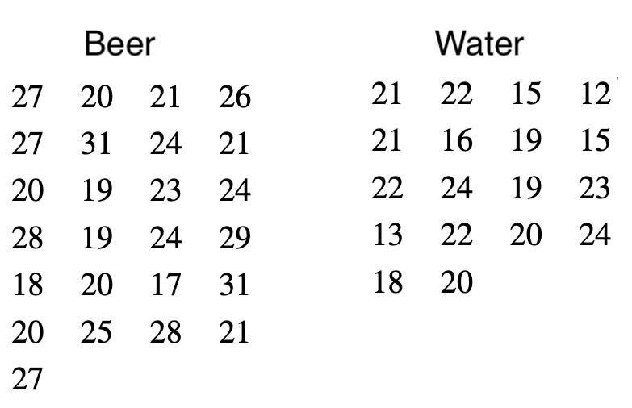

---
# YAML metadata
title: "Resampling as a cure for traditional statistics"
author: Matthew Brett
---

# A mosquito problem

With thanks to John Rauser: [Statistics Without the Agonizing Pain](https://www.youtube.com/watch?v=5Dnw46eC-0o)

# The data

# The t-test

# The permutation way

* Calculate difference in means
* Pool
* Repeat many times:
    * Shuffle
    * Split
    * Recalculate difference in means
    * Store

# On balls

# The difference in means

# The difference in means: 23.60 - 19.22 4.38

# Shuffle

# A difference if the null is true

# One difference on null: 22.84 - 20.28 = -1.26

# And again

# Another difference on null: 22.20 - 21.17 = 1.03

# And so on, 10000 times

# But how?

On to the notebook.
